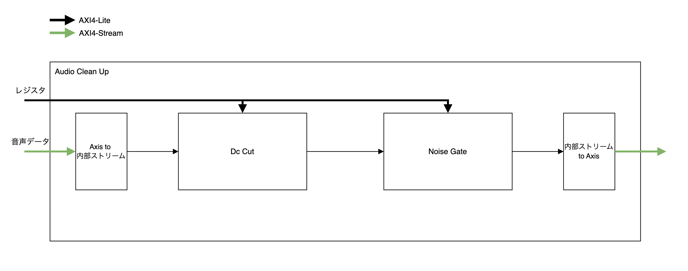
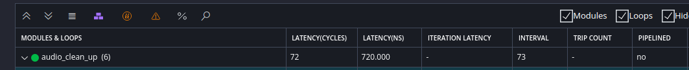
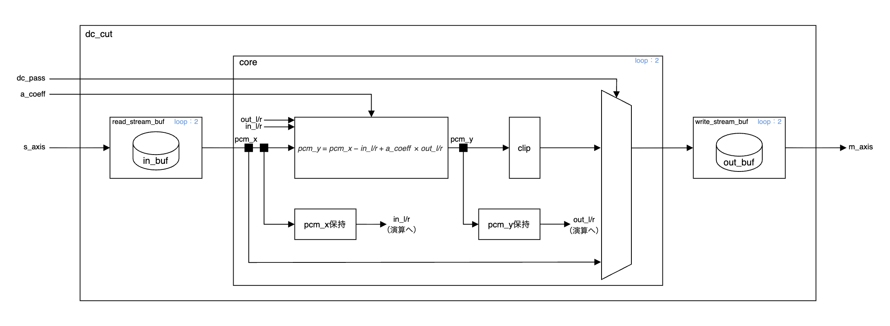
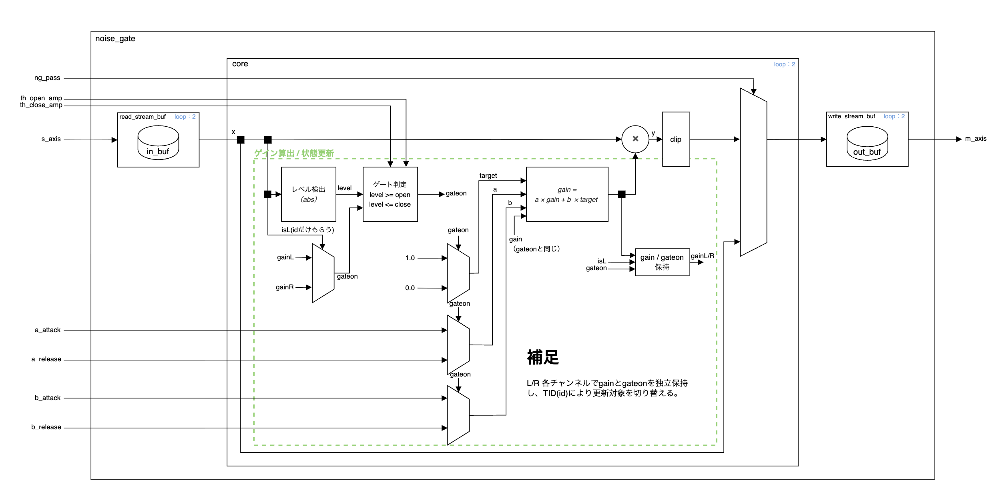

# AudioCleanUp HLS設計書

## 1. 概要
AudioCleanUpは、マイク入力のオーディオ信号に対してノイズ低減を行うための HLS IP である。

本IPは **DC Cut** および **Noise Gate** の2つの処理ブロックから構成され、
AXI4-Streamで入力されたステレオPCMデータをリアルタイムに処理し、同形式で出力する。

本書はAudioCleanUp HLS IPの内部仕様を定義するものであり、
システム全体のブロック構成、クロック／リセット、AXI 接続およびアドレス割当は
別紙「FPGA設計書」に従う。

---

## 2. 設計前提・仕様条件

- 入力は 48kHz / 16bit / ステレオPCM を前提とする
- AXI4-Stream は常時 TREADY=1 を想定（バックプレッシャ非対応）
  - 本IPはAudio Stream処理専用であり、上流・下流ともに
    リアルタイム処理が保証される構成を前提とする
- サンプル欠落・不連続は上位モジュールで対処済みとする
- 内部状態はリセット時にクリアされる
- 本IPは可変サンプリングレートには対応しない

---

## 3. システム構成
### 3-1. 全体図
以下のシステムで構成される。

### 3-2. 機能一覧
| ブロック名 | 機能 | 入力 | 出力 |
|---|---|---|---|
| Dc Cut | DCオフセット除去 | PCMサンプル | DC成分除去後PCM |
| Noise Gate | 無音区間のノイズ低減 | PCMサンプル | ゲイン制御後PCM |

---

## 4. データフォーマット
本システムでは、FPGAリソースの最適化とオーディオ信号品質の維持のため、以下のデータ形式および固定小数点型を採用している。

### 4-1. AXI4-Streamデータ形式
- **データ幅**: 32bit (`ap_uint<32>`)
- **オーディオサンプル格納位置**: `[27:12]` (16bit)
  - MSB: bit 27
  - LSB: bit 12
- **チャンネル順序**: Interleaved (Left, Right, Left, Right...)
- **TID**: `0` = Left, `1` = Right

### 4-2. 固定小数点表現の基本方針
- 内部演算には `ap_fixed<W, I>` を使用する
- 各サブモジュールの具体的な型定義は6章以降にて定義する

---

## 5. 処理フロー詳細

### 5-1. 全体フロー
1.  **Axis to 内部ストリーム処理**： AXI4-Stream入力から2チャンネル分のデータを読み込む。
2.  **Dc Cut処理**：
    -   Lch/Rch それぞれの内部状態 (`prev_in`, `prev_out`) を更新しながら `y[n] = x[n] - x[n-1] + a*y[n-1]` を計算。
3.  **Noise Gate処理**：
    -   現在の入力絶対値 `|x[n]|` を計算。
    -   Open/Close閾値と比較し、ゲート状態(`gate_open`)を更新。
    -   Attack/Release 係数を用いて現在のゲイン `G[n]` を更新。
    -   `y[n] = x[n] * G[n]` を計算。
4.  **内部ストリーム to Axis処理**： 結果をAXI4-Stream出力へ書き込む。

### 5-2. タイミングとスループット（解析結果）
Vitis HLSの合成レポートおよびシステム要件に基づくタイミング解析結果は以下の通りである。

- **システムクロック ($F_{clk}$)**: 100 MHz (周期 $T_{clk} = 10 \text{ns}$)
- **サンプリングレート ($F_s$)**: 48 kHz (周期 $T_s \approx 20.83 \text{µs}$)
- **1サンプルあたりの利用可能サイクル数**:

$$ \frac{100 \times 10^6 \text{ Hz}}{48 \times 10^3 \text{ Hz}} \approx 2083 \text{ cycles} $$

#### 5-2-1. HLS合成結果

- **Latency (レイテンシ)**: 72 cycles ($0.72 \text{µs}$)
- **II (Interval)**: 73 cycles ($0.73 \text{µs}$)
  - これは、ある入力を受け付けてから次の入力を受け付ける準備ができるまでの時間を指す。

#### 5-2-2. タイミングマージン
- **処理時間**: $0.73 \text{µs}$
- **データ到着間隔**: $20.83 \text{µs}$
- **マージン**: $20.83 - 0.73 = 20.1 \text{µs}$
- **結論**: データ到着間隔に対して処理時間はわずか **3.5%** 程度であり、残りの96.5%はアイドル状態となる。したがって、本モジュールは48kHzのリアルタイムオーディオ処理に対して十分な性能マージンを有しており、遅延や音切れの問題は理論上発生しない。

---

## 6. 端子仕様

本章では、AudioCleanUpが提供する入出力端子の一覧および役割を定義する。

### 6-1. 端子一覧

| ポート名 | Direction | Interface | Signal | bit幅 | 説明 |
|---|---|---|---|---:|---|
| ap_clk | In | Clock | ap_clk | 1 | クロック。 |
| ap_rst_n | In | Reset | ap_rst_n | 1 | アクティブLowリセット。 |
| interrupt | Out | Interrupt | interrupt | 1 | 割り込み出力。 |
| s_axi_acu | In/Out | AXI4-Lite | ARADDR | 7 | AXI4-Lite Read Address。 |
| s_axi_acu | In | AXI4-Lite | ARVALID | 1 | AXI4-Lite Read Address Valid。 |
| s_axi_acu | Out | AXI4-Lite | ARREADY | 1 | AXI4-Lite Read Address Ready。 |
| s_axi_acu | In/Out | AXI4-Lite | AWADDR | 7 | AXI4-Lite Write Address。 |
| s_axi_acu | In | AXI4-Lite | AWVALID | 1 | AXI4-Lite Write Address Valid。 |
| s_axi_acu | Out | AXI4-Lite | AWREADY | 1 | AXI4-Lite Write Address Ready。 |
| s_axi_acu | In | AXI4-Lite | WDATA | 32 | AXI4-Lite Write Data。 |
| s_axi_acu | In | AXI4-Lite | WSTRB | 4 | AXI4-Lite Write Strobe。 |
| s_axi_acu | In | AXI4-Lite | WVALID | 1 | AXI4-Lite Write Valid。 |
| s_axi_acu | Out | AXI4-Lite | WREADY | 1 | AXI4-Lite Write Ready。 |
| s_axi_acu | Out | AXI4-Lite | RDATA | 32 | AXI4-Lite Read Data。 |
| s_axi_acu | Out | AXI4-Lite | RRESP | 2 | AXI4-Lite Read Response。 |
| s_axi_acu | Out | AXI4-Lite | RVALID | 1 | AXI4-Lite Read Valid。 |
| s_axi_acu | In | AXI4-Lite | RREADY | 1 | AXI4-Lite Read Ready。 |
| s_axi_acu | Out | AXI4-Lite | BRESP | 2 | AXI4-Lite Write Response。 |
| s_axi_acu | Out | AXI4-Lite | BVALID | 1 | AXI4-Lite Write Response Valid。 |
| s_axi_acu | In | AXI4-Lite | BREADY | 1 | AXI4-Lite Write Response Ready。 |
| s_axis | In | AXI4-Stream | TDATA | 32 | オーディオ入力データ。16bit PCM を [27:12] に格納。 |
| s_axis | In | AXI4-Stream | TID | 2 | チャンネル識別子。0=Left, 1=Right。 |
| s_axis | In | AXI4-Stream | TVALID | 1 | 入力データ有効。 |
| s_axis | Out | AXI4-Stream | TREADY | 1 | 入力受信可能。 |
| m_axis | Out | AXI4-Stream | TDATA | 32 | オーディオ出力データ。処理後の 16bit PCM を [27:12] に格納。 |
| m_axis | Out | AXI4-Stream | TID | 2 | 入力のTIDをそのまま引き継ぐ。 |
| m_axis | Out | AXI4-Stream | TVALID | 1 | 出力データ有効。 |
| m_axis | In | AXI4-Stream | TREADY | 1 | 出力受信可能。 |

---

## 7. サブモジュール仕様
本章では、各サブモジュールの機能・アルゴリズム・制御パラメータの意味を定義する。

### 7-1. DC Cut (`dc_cut`)
#### 7-1-1.機能
1次IIRハイパスフィルタを用いて、入力信号に含まれる直流成分（DC オフセット）を除去する。

#### 7-1-2. ブロック図

#### 7-1-3. アルゴリズム
以下の差分方程式に基づき処理を行う。

$$ y[n] = x[n] - x[n-1] + a \times y[n-1] $$

- `x[n]` : 入力サンプル
- `y[n]` : 出力サンプル
- `a`    : DC Cut係数

#### 7-1-4. 内部演算精度

DC Cutの内部演算には以下の固定小数点型を使用する。

| 用途 | 型名 | 定義 | 説明 |
|---|---|---|---|
| 入力/出力状態 | sample_t_dc | ap_fixed<34, 19> | フィードバック演算により一時的に振幅が拡大する可能性があるため、十分な整数部ビット幅を確保する |
| フィルタ係数 | coef_t_dc | ap_fixed<16, 1> | 範囲 [-1.0, 1.0) を表現可能 |

#### 7-1-5.パラメータ
| パラメータ名 | ソフトウェア視点の型 | 説明 |
|---|---|---|
| a_coef | float | DC Cutフィルタ係数。1.0に近いほどカットオフ周波数は低くなる。内部では固定小数点に量子化される。 |
| dc_pass | bool | trueの場合、DC Cut処理をバイパスする。レイテンシが変わってくるため動作停止中のみ変更可とする。 |

---

### 7-2. Noise Gate (`noise_gate`)
#### 7-2-1. 機能
入力信号の振幅レベルに応じてゲインを動的に制御し、無音区間におけるバックグラウンドノイズを低減する。

#### 7-2-2. ブロック図

#### 7-2-3. アルゴリズム
1.  **レベル検出**: `level = abs(x)`
2.  **ゲート判定（ヒステリシス）**:
    -   `level >= th_open_amp` $\rightarrow$ Gate Open (Target=1.0)
    -   `level <= th_close_amp` $\rightarrow$ Gate Close (Target=0.0)
    -   中間値の場合は前回の状態を維持
3.  **ゲイン更新 (1次遅れ)**:

$$ G[n] = \alpha \times G[n-1] + (1-\alpha) \times Target $$

  -  $\alpha$ はAttack/Release状態で切り替え
4.  **出力**: `output = input * G[n]`

#### 7-2-4. 内部演算精度

Noise Gateの内部演算には以下の固定小数点型を使用する。

| 用途 | 型名 | 定義 | 説明 |
|---|---|---|---|
| 入力/レベル/出力 | sample_t_ng | ap_fixed<34, 19> | ゲイン乗算および一次遅れ演算に備え、十分な整数部ビット幅を確保する |
| ゲイン係数 | coef_t_ng | ap_fixed<24, 2> | ゲインおよびAttack/Release係数に使用 |
| 閾値 | th_open_amp / th_close_amp | signed 34bit | Q15値を符号拡張して格納し、内部演算と同一スケールで比較する |

#### 7-2-5. パラメータ
| パラメータ名 | ソフトウェア視点の型 | 説明 |
|---|---|---|
| th_open_amp | float (SW) / signed 34bit (HW) | ゲートを開く閾値。SWは0.0〜1.0の正規化値をQ15化し、HWでは符号拡張してsigned 34bitとして扱う。 |
| th_close_amp | float (SW) / signed 34bit (HW) | ゲートを閉じる閾値。同上。 |
| a_attack | fixed | ゲート開放時の係数 α |
| a_release | fixed | ゲート閉鎖時の係数 α |
| b_attack | fixed | Attack 時の係数 β (= 1 - α) |
| b_release | fixed | Release 時の係数 β (= 1 - α) |
| ng_pass | bool | trueの場合、Noise Gate処理をバイパスする。レイテンシが変わってくるため動作停止中のみ変更可とする。 |

## 8. レジスタマップ

本章では、本IPが提供するAXI4-Lite制御レジスタのアドレス空間および属性を定義する。
制御プロトコルは `ap_ctrl_hs` を使用する。
`ap_ctrl_hs` の制御プロトコルについては公式のドキュメントを参照すること。

- レジスタ幅は32bitでアクセスする。
- `ap_start` により処理開始し、`ap_done` / `ap_ready` をステータスとして参照する。
- 割り込み制御用の GIE / IER / ISR を備える。本システムでは使用しない。

用語:
- **SC**  : Self Clear
- **COR** : Clear on Read
- **TOW** : Toggle on Write
- **COH** : Clear on Handshake

### 8-1. 制御・割り込みレジスタ（ap_ctrl_hs）

| オフセット | Register | ビット幅 | Name | Access | 説明 |
|---:|---|---:|---|---|---|
| 0x00 | Control | 0 | ap_start | R/W/COH | 1を書き込むと処理開始  ハンドシェイクでクリアされる |
| 0x00 | Control | 1 | ap_done | R/COR | 処理完了で1となりReadでクリア |
| 0x00 | Control | 2 | ap_idle | R | アイドル状態で1 |
| 0x00 | Control | 3 | ap_ready | R/COR | 次開始可能で1となりReadでクリア |
| 0x00 | Control | 7 | auto_restart | R/W | 1で自動再スタート有効 |
| 0x00 | Control | 9 | interrupt | R | 割り込み出力状態 |
| 0x04 | GIE | 0 | gie | R/W | Global Interrupt Enable |
| 0x08 | IER | 0 | ier_ap_done | R/W | ap_done 割り込み許可 |
| 0x08 | IER | 1 | ier_ap_ready | R/W | ap_ready 割り込み許可 |
| 0x0C | ISR | 0 | isr_ap_done | R/TOW | ap_done 割り込みステータス |
| 0x0C | ISR | 1 | isr_ap_ready | R/TOW | ap_ready 割り込みステータス |

### 8-2. パラメータレジスタ（AudioCleanUp制御パラメータ）

本IPの信号パラメータは以下のレジスタから設定する。
一部の信号は32bitを超えるため、下位/上位に分割して格納される。

**しきい値 `th_open_amp` / `th_close_amp` は signed 34bitとして扱い、ソフトウェア側ではQ15値を符号拡張して格納する（Q34の有効ビットは [33:0]）。**

| オフセット | Signal | ビット幅 | Field | Access | 説明 |
|---:|---|---:|---|---|---|
| 0x10 | dc_a_coef | 31:0 | dc_a_coef[31:0] | R/W | 32bit 全域を使用（内部で固定小数点へ量子化） |
| 0x14 | reserved | - | - | - | 予約 |
| 0x18 | dc_pass | 0 | dc_pass[0] | R/W | 1で DC Cutをバイパス |
| 0x1C | reserved | - | - | - | 予約 |
| 0x20 | th_open_amp | 31:0 | th_open_amp[31:0] | R/W | **signed 34bit** の下位32bit |
| 0x24 | th_open_amp | 1:0 | th_open_amp[33:32] | R/W | **signed 34bit** の上位2bit（他ビットは予約） |
| 0x28 | reserved | - | - | - | 予約 |
| 0x2C | th_close_amp | 31:0 | th_close_amp[31:0] | R/W | **signed 34bit** の下位32bit |
| 0x30 | th_close_amp | 1:0 | th_close_amp[33:32] | R/W | **signed 34bit** の上位2bit（他ビットは予約） |
| 0x34 | reserved | - | - | - | 予約 |
| 0x38 | a_attack | 23:0 | a_attack[23:0] | R/W | 24bit |
| 0x3C | reserved | - | - | - | 予約 |
| 0x40 | a_release | 23:0 | a_release[23:0] | R/W | 24bit |
| 0x44 | reserved | - | - | - | 予約 |
| 0x48 | b_attack | 23:0 | b_attack[23:0] | R/W | 24bit |
| 0x4C | reserved | - | - | - | 予約 |
| 0x50 | b_release | 23:0 | b_release[23:0] | R/W | 24bit |
| 0x54 | reserved | - | - | - | 予約 |
| 0x58 | ng_pass | 0 | ng_pass[0] | R/W | 1で Noise Gateをバイパス |
| 0x5C | reserved | - | - | - | 予約 |

## 9. 参考文書

| No. | 文書名 | 発行元 | リンク |
|---:|---|---|---|
| 1 | Vitis高位合成ユーザーガイド (UG1399) | AMD / Xilinx | https://docs.amd.com/r/ja-JP/ug1399-vitis-hls |
| 2 | FPGA設計書 | 自分 | 後で書く |
